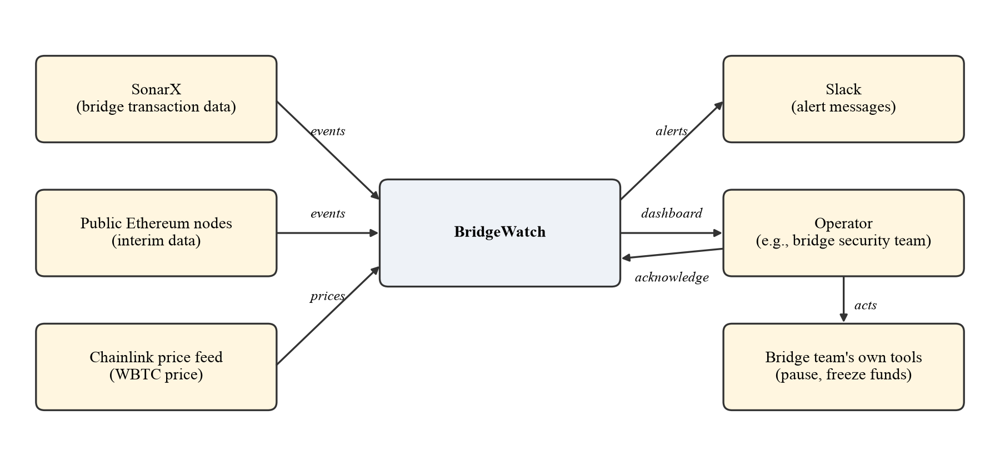

# Project Proposal — BridgeWatch: Real-Time Detection of Cross-Chain Bridge Exploits

**Department of Computer Science**
**CPSC 490 Undergraduate Seminar in Computer Science — Proposal for Capstone Project**

**Group 16 — Neuroprosthetic** · Sponsor: SonarX, project SNX-3 · Mentor: Erel Saul
Authors: Samuel, Gary Bennet (garybs16); Bowen, Jake (JakeBowen2005);
Jaglan, Avni (Avnijaglan19); Acuna, Isaac (1600isad)
Faculty advisor: Kyoung Shin · Semester: Fall 2026
Proposal date: 2026-10-04
Repository: https://github.com/garybs16/CPSC490-G16-Neuroprosthetic

> **This file is the proposal document, not a README.** It is the Markdown
> copy of the proposal the team submitted on 4 October 2026, with the course
> template's section numbering. The only additions are the issue links in
> Section 2 and the filed tasks in Section 4 (Table 10), which tie the
> document to the project board. Keep this copy current: it is what peer
> review and CI can read.

---

## 0. Abstract

Bridges in crypto settings allow people to move cryptocurrency from one
blockchain to another. Each bridge keeps everyone’s deposited money in one
place on the blockchain, called the vault. Vaults often hold hundreds of
millions of dollars at a time, so hackers target them deliberately. Bridge
hacks had cost about $2 billion by August 2022 [1], and the Orbit Chain
bridge lost about $82 million on 31 December 2023 [2], a sign of a much
deeper problem in cryptocurrency security.

Every blockchain transaction is public, so a hack can be seen while it
happens, which is beneficial. The problem is spotting a hack/breach quickly
without raising a false alarm every time someone makes a large, honest
withdrawal. This is non-trivial because normal activity varies widely by
bridge and by hour, and a detector that raises alarms too often is ignored
while one that waits too long is useless. Our sponsor, SonarX, which indexes
data from more than 130 blockchains [3], asked for a tool that does this
efficiently.

We propose BridgeWatch, an alarm system for bridge vaults to protect against
these types of vulnerabilities. Our application will learn how much money
normally leaves each vault at each hour of the day. It will then notice when
withdrawals jump far above normal, and will send an alert that explains the
problem in one sentence so that it stays uncluttered and gets straight to
the point.

Our goals are to learn what normal activity looks like for each major
bridge, to catch hacks early with few false alarms, and to give the operator
a dashboard they can act on, while making sure the system works correctly
with few bugs. We will test BridgeWatch by replaying real past hacks, such
as the Orbit Chain hack, and measure how quickly it alerts and how often it
raises false alarms on normal days. By the end of CPSC 491, we will deliver
a working alert dashboard for the major bridges, tested on past hacks, with
a measured false-alarm rate for the application.

The rest of this proposal explains how bridges work and why they are
attacked, reviews existing work, states the problems we address, and then
presents our goals, approach, required resources, expected outcomes, and
timeline.

## 1. Introduction

**Blockchains and bridges.** The main definition of a blockchain is that it
is a public record of transactions that no single company controls.
Ethereum, Arbitrum, Base and OP Mainnet are separate blockchains, and money
on one cannot be used directly on another. A bridge solves this. To move
1 ETH from Ethereum to Arbitrum, a user deposits it into the bridge’s vault
on Ethereum and receives 1 ETH on Arbitrum. When the user moves it back, the
vault releases the original ETH.

The programs that run on a blockchain are called smart contracts. A bridge
vault is a smart contract, and every time tokens enter or leave it, the
blockchain keeps a permanent, public record of the transfer: which token
moved, how much, from which address and to which address. These records are
the raw material for BridgeWatch. Anyone can read them, but reading them
across many blockchains at once is a large data problem. Our sponsor,
SonarX, collects and organizes this data for more than 130 blockchains [3]
and delivers it to its customers through data warehouses, files and
real-time streams [4].

Bridges differ in how they decide that a withdrawal is legitimate. In many
bridges, a small group of approvers, called signers or validators, must sign
off before the vault pays out. In others, the bridge relies on a program
that checks a mathematical proof that a deposit really happened on the other
blockchain [5]. Either way, the vault holds real assets on one side and
trusts a message about the other side. The largest bridges each hold
billions of dollars in this way [6].

**Why vaults get hacked.** Thousands of people use the same bridge, so the
vault holds everyone’s money in one place. The vault pays out only when the
bridge approves a withdrawal. A hacker who steals the approval keys, or
finds a bug in the approval check, can make the vault pay them instead [5].
Table 1 lists several well-known bridge hacks. About half of them were
caused by stolen keys rather than by a bug in the code, which means that
reviewing the bridge’s code could not have caught them, but watching the
money leave the vault could have revealed them.

**What a hack looks like.** In the Orbit Chain hack, attackers who
reportedly had stolen the bridge’s keys took about $82 million [2]. The
attackers withdrew about 9,500 ETH, 30 million USDT, 10 million USDC,
10 million DAI and 231 WBTC from the bridge’s Ethereum vault [2]. Every one
of these withdrawals was public, so anyone watching could have seen it
happen. The Ronin hack shows the cost of not watching: the stolen funds left
the vault in only two transactions, yet nobody noticed for about six
days [7].

*Table 1. Notable cross-chain bridge hacks.*

| Bridge | Date | Approx. loss | What happened |
|---|---|---|---|
| Ronin | Mar 2022 | $625 million | Attackers controlled five of nine validator keys and withdrew ETH and USDC; the theft was noticed about six days later [7]. |
| Wormhole | Feb 2022 | $320 million | A flaw in signature checking on Solana let the attacker create 120,000 wrapped ETH with nothing locked behind it [8]. |
| Nomad | Aug 2022 | $190 million | A faulty upgrade made any message look valid, and many copycat addresses drained the bridge [9]. |
| Harmony Horizon | Jun 2022 | $100 million | Two of the five keys of a two-of-five multisignature wallet were compromised [10]. |
| BNB Bridge | Oct 2022 | $570 million | Forged proofs let the attacker create two million BNB [11]. |
| Multichain | Jul 2023 | $130 million | Large unannounced outflows left several of its vaults [12]. |
| Orbit Chain | Dec 2023 | $82 million | Compromised private keys were used to empty the Ethereum vault [2]. |
| KelpDAO (LayerZero) | Apr 2026 | $292 million | A fake message released tokens on Ethereum with no matching burn on the source chain [13]. |

**Why hacks are hard to catch.** Normal activity changes by bridge, by hour
and by day. A large, honest withdrawal can look exactly like the start of a
hack. An alarm that goes off too often gets ignored, and one that waits too
long is useless. The operators who need this tool are those who respond to
attacks, such as a bridge’s security team. Our sponsor names the same two
difficulties as the heart of the project: deciding what counts as normal,
and keeping the false-alarm rate low enough that a person will keep paying
attention.

**What BridgeWatch does differently.** Unlike volunteer-written Forta
monitoring bots [14] or closed commercial services such as Hypernative [15]
and Hexagate [16], BridgeWatch will combine four properties. It will learn
each bridge’s own normal pattern for each hour of the day. It will check
every withdrawal as soon as it is confirmed. It will explain every alert in
one plain sentence. Finally, it will measure and report how often it raises
false alarms, so an operator can judge whether to trust it.

Table 2 defines the key terms used throughout this proposal.

*Table 2. Key terms.*

| Term | Meaning in this proposal |
|---|---|
| Blockchain | A public, permanent record of transactions (e.g., Ethereum) |
| Smart contract | A program on a blockchain that runs automatically |
| Bridge | A service that moves tokens between two blockchains |
| Vault | The bridge’s smart contract that holds all deposited tokens |
| Release (withdrawal) | Tokens leaving the vault |
| Signers / keys | The approvers whose sign-off lets the vault release tokens |
| Stablecoin | A token designed to stay worth $1 (USDT, USDC, DAI) |
| WBTC | Wrapped Bitcoin: a token on Ethereum worth 1 Bitcoin |
| Whale | A holder who legitimately moves very large amounts |
| Drain | An attacker emptying a vault |
| Baseline | What normal activity looks like for a bridge at a given hour |
| False alarm | An alert when no attack is happening |
| Operator | The person who watches BridgeWatch and responds to alerts |

### 1.1 Related Work

**Research.** A survey by Zhang et al. lists 12 ways bridges can be attacked
and 10 types of real attacks [5]. We use it to choose which attacks to test.
Xscope [17] scans bridge transactions for three known types of bugs and
found all known attacks on four bridges. It is a tool for finding known bug
patterns rather than a live alarm, and it does not report a false-alarm
rate. Liu et al. [18] showed that checking whether money in on one chain
equals money out on the other would have identified every known attack in
their dataset. This check needs data from both chains, and using it live
requires bridges to change their code.

XChainWatcher [19] is the closest research to our project. It matches each
deposit on one chain with the corresponding withdrawal on the other and
applies a set of rules to the matched pairs. When run on historical data
from the Ronin and Nomad bridges, it flagged the attack transactions. Its
strength is precision, because a withdrawal with no matching deposit is
almost certainly an attack. Its cost is that each bridge must be decoded and
matched on both chains, which is a large engineering effort per bridge.

**Free community tools.** Forta [14] offers bots written by volunteers that
watch for draining and unusual activity, including a bot that compares the
balances on the two sides of a bridge. Users must choose and adjust the bots
themselves, and false-alarm rates are not reported.

**Paid services.** Hypernative [15] and Hexagate [16] use machine learning
and can spot an attack before its transactions are confirmed. They will
likely perform better than a student project. However, they cost money,
their methods are secret, and their accuracy claims cannot be checked by
outsiders.

*Table 3. Existing approaches compared with BridgeWatch.*

| Approach | What it does | Pros | Cons | How BridgeWatch differs |
|---|---|---|---|---|
| Bridge security survey [5] | Lists bridge attack types | Broad, organized view of attacks | Not a tool | We use it to pick attacks to test |
| Xscope [17] | Scans for three known bug types | Found all known attacks on four bridges | Only finds bugs it knows; no live alerts | Watches money flow, so no bug list is needed; live alerts |
| Accounting check [18] | Checks money in equals money out | Would have identified every attack in its dataset | Needs both chains’ data; bridges must change code | Uses this check where possible; otherwise watches one vault |
| XChainWatcher [19] | Matches deposits to withdrawals across chains | Very precise; flagged Ronin and Nomad attacks | Heavy per-bridge decoding on both chains | Starts with one-sided vault monitoring that works for any vault |
| Forta [14] | Volunteer-written monitoring bots | Free and open | User must set up bots; no false-alarm rates | Ready to use; measured false-alarm rate |
| Hypernative [15] | Paid, machine learning, warns before funds move | Earliest warning | Paid, secret, unverifiable claims | Free, open, results anyone can check |
| Hexagate [16] | Paid, machine learning, warns before funds move | Earliest warning | Paid, secret, unverifiable claims | Free, open, results anyone can check |

Taken together, these approaches either find known bugs, require heavy
per-bridge engineering, leave tuning to the user, or keep their methods and
accuracy private. We did not find a free, open tool that combines learning
each bridge’s normal activity, live plain-language alerts, and a published
false-alarm rate. BridgeWatch aims to fill that gap. It will not warn
earlier than paid services that check transactions before they are
confirmed, and it borrows the cross-chain accounting idea from Liu et al.
and XChainWatcher wherever data from both chains is available.

### 1.2 Problem Statements

SonarX describes the project as follows:

> *Monitor cross-chain bridge activity across SonarX’s 130-plus chains and
> detect the early signals of an exploit or drain in real time. Ingest
> bridge transaction data, establish baseline flow patterns for the major
> bridges, and build detection logic that fires the moment withdrawals or
> liquidity movements deviate. Deliverable: an alerting dashboard that could
> have caught recent bridge hacks as they unfolded. Note the two things that
> make this hard and belong in your objectives: a baseline of normal, and a
> false-alarm rate a human would tolerate.*

Our mentor at SonarX is Erel Saul. From this description, we identify four
problems, summarized in Table 4.

*Table 4. Problems and the goals that solve them.*

| Problem | Why it matters | Solved by |
|---|---|---|
| P1. Nobody knows what “normal” looks like | A withdrawal is only suspicious compared with what is usual for that bridge at that hour. | Goal 1 |
| P2. Hacks happen faster than people notice | A drain can empty a vault in a handful of withdrawals, and the Ronin theft went unnoticed for about six days [7]. Tomorrow’s report is too late. | Goal 2 |
| P3. Too many false alarms get the tool ignored | Large honest withdrawals look like attacks. If the alarm rings too often, people stop listening. | Goal 2 |
| P4. A warning only helps if someone understands it | The alert must reach a person who can act and say clearly what happened. | Goal 3 |

## 2. Goals and Objectives

Each goal is tracked on the team’s GitHub board as an epic, and each
objective as a user story. The numbers in the objectives are our proposed
targets; we will confirm them with our SonarX mentor and update this section
if they change. Throughout, *real time* means that BridgeWatch evaluates a
withdrawal within one minute of the block that contains it being confirmed
six blocks deep, which protects against short chain reorganizations.

**Goal 1: Learn what normal bridge activity looks like (P1).** Epic #11.

- **Objective 1.1.** Collect every deposit and withdrawal for three major
  bridges from SonarX’s real-time stream, no more than five minutes behind
  the latest block. (#14)
- **Objective 1.2.** Compute the normal outflow range for each bridge and
  each hour of the day from the past seven days, and show that at least 95%
  of normal 10-minute periods fall inside this range. This objective
  measures how well the baseline describes normal days and allows alerts to
  fire only far above this range, so it does not set the alert rate. (#15)

**Goal 2: Catch hacks early with few false alarms (P2, P3).** Epic #12.

- **Objective 2.0.** Build a first prototype and demonstrate it on live
  Ethereum data and on one real past hack, making sure all results are
  valid. (#5)
- **Objective 2.1.** Build three alert rules: a sudden jump in money
  leaving, an unusual burst of withdrawals, and the vault losing more than a
  set share of its money in one hour. Each alert explains itself in plain
  words. (#16)
- **Objective 2.2.** Replay five past hacks in which tokens left an Ethereum
  vault (for example, Orbit, Multichain and Harmony). For each, report the
  minutes from the first theft to the first alert and how much money was
  already gone, with the proposed target of alerting before half of the
  stolen funds had left in at least four of the five replays. (#17)
- **Objective 2.3.** Count false alarms per bridge over at least 30 normal
  days, and set the alert level to meet a proposed target of no more than
  one false alarm per bridge per week, to be confirmed with the
  mentor. (#18)
- **Objective 2.4 (stretch).** Where SonarX provides data from both sides of
  a bridge, add the cross-chain accounting check and report how many
  replayed hacks it detects. (#19)

**Goal 3: Give the operator a dashboard they can act on (P4).** Epic #13.

- **Objective 3.1.** Build a live dashboard showing each bridge’s status,
  its money flow compared with normal, and a list of alerts the operator
  can mark as seen, which is useful for seeing activity at a glance. (#20)
- **Objective 3.2.** Test the dashboard with four users on a replayed hack,
  and record whether they notice and understand the alert within five
  minutes. (#21)

These objectives map directly onto the sponsor’s two difficulties.
Objectives 1.2 and 2.3 turn “a baseline of normal” and “a false-alarm rate
a human would tolerate” into numbers that can be checked, and Objective 2.2
measures whether BridgeWatch could have caught real hacks as they unfolded.

## 3. Proposed Approaches

BridgeWatch will watch every deposit into and withdrawal from each bridge’s
vault, and compare it with what is normal for that bridge at that hour. The
approach has three steps.

**Step 1: Learn what is normal.** For each hour of the day, BridgeWatch will
record how much money left each vault over the past week. It will use the
median (the middle value) instead of the average, because one huge
withdrawal can pull the average up but barely moves the median [20]. To
measure how much activity normally varies, it will use the median absolute
deviation, which is the median distance of each value from the median. A
new 10-minute period is then scored by how many of these typical deviations
it sits above the median for that hour. Because many hours have no outflow
at all, the median and the deviation can both be zero, so BridgeWatch will
use a minimum spread (for example, $100,000) and a separate size rule for
single large withdrawals. We chose hour-of-day buckets because bridge
traffic follows daily cycles; during Sprint 3 we will check whether
day-of-week patterns also matter.

**Step 2: Check new withdrawals against three rules.** The first rule,
*outflow spike*, fires when far more money left in the last 10 minutes than
is normal for this hour. The second rule, *withdrawal burst*, fires when
there are far more withdrawals than usual in a short time, which is the
pattern of copycat drains such as Nomad [9]. The third rule, *vault drain*,
fires when the vault lost more than a set share of its money within one
hour, whatever the time of day. When data from both blockchains is
available, a fourth rule can check that money leaving one side matches money
entering the other [18] [19], which is the signal that would have exposed
the Ronin, Wormhole and KelpDAO thefts [7] [8] [13].

**Step 3: Explain the alert.** Every alert will name the bridge, the amount,
the time window and the comparison with normal. For example, an alert might
read: “$10.0M left the Orbit bridge vault in the last 10 minutes; normally
nothing leaves at this hour.” Repeated alerts for the same event will be
grouped, so an operator receives one message per incident rather than one
per transaction.

**Why not machine learning?** There have been too few real bridge hacks to
train a model, and people ignore alerts they cannot understand. Simple rules
can be explained, need little data, and are controlled by one setting that
we can tune on purpose. Table 5 summarizes the alternatives we considered.

*Table 5. Alternatives considered.*

| Alternative | Why we did not choose it |
|---|---|
| Machine-learning model trained on past hacks | Too few hacks to learn from; alerts hard to explain |
| Machine learning without examples (anomaly detection) | Harder to explain; may test later as an extra layer |
| Average-based “normal” | Easily thrown off by one large withdrawal [20] |
| Checking transactions before they are confirmed | Needs data SonarX does not provide; out of scope |

**How we will test it.** To show that BridgeWatch could have caught real
hacks, we will replay saved transaction history through the same detector
that watches live data. The replay will feed transactions in time order on a
simulated clock, so the detector can never see the future. Each replay will
start with several normal days, so the baseline is learned before the hack
begins. For each hack, we will record the time from the first theft to the
first alert and the money already lost by then. We will also replay long
stretches of normal activity and count every alert as a false alarm, which
gives the false-alarm rate per bridge per week required by Objective 2.3.

We will also test three kinds of simulated attack that the real hacks do not
fully cover: a large, fast theft; stolen keys used for one huge first
withdrawal; and a slow theft in many small amounts. We expect most false
alarms to come from large honest withdrawals by whales, so the alert level
will be tuned against them.

**Limitations.** BridgeWatch only sees withdrawals after they happen. It
cannot stop a hacker who takes most of the vault in the first withdrawal. In
the first version it will also track tokens only (USDT, USDC, DAI and WBTC),
not native ETH, which does not produce the same token transfer records. This
gap matters: the roughly 9,500 ETH stolen in the Orbit hack [2] would be
invisible to the first version, so adding native ETH is planned for
CPSC 491. Finally, the canonical rollup bridges in our starting scope make
withdrawals wait about a week before the vault pays out, so for them the
request to withdraw is an earlier signal than the payout itself; we will
evaluate watching those requests as an extension.

## 4. Required Environment, Resources, and Planned Activities

Table 6 lists the resources we need and their current status.

*Table 6. What we need.*

| Resource | What we plan to use | Status |
|---|---|---|
| Bridge data | SonarX transfer, balance and price data; real-time stream for live data [4] | To request from mentor |
| Temporary data | Public Ethereum nodes anyone can query | Planned |
| Prices and balances | SonarX USD prices and vault balances; stablecoins at $1 and a Chainlink feed for WBTC as a fallback [21] | Planned |
| Software | Python 3.12, FastAPI, SQLite database (enough for a dozen vault-token pairs; a data warehouse if we scale beyond one chain) | Planned |
| Dashboard | A web page with charts | Planned |
| Alerts | Messages sent to Slack or similar apps | Planned |
| Testing | Automated tests on GitHub for every change | Planned |
| Hosting | Packaged with Docker; host not chosen | Not decided |

**Planned starting scope.** The first version will watch the Ethereum
vaults of three bridges (Arbitrum One, Base and OP Mainnet) for four tokens
(USDT, USDC, DAI and WBTC), because their vault addresses are public and
their traffic is steady enough to learn a baseline. Replays will use the
Ethereum vaults of drained bridges such as Orbit. We will add bridges once
SonarX data is available. A demo mode will run simulated bridges with a
button that simulates a hack, so the alerts can be shown without waiting for
a real attack.

**How the system will work.** BridgeWatch will collect every transfer in and
out of each vault, save it, and check it against that bridge’s normal
pattern. Alerts will be sent to Slack and shown on the dashboard. Figure 1,
at the end of this section, shows the system design. Because the detector
reads only common event records, switching from public Ethereum nodes to
SonarX will change only the first step. Figure 2 shows BridgeWatch in its
environment: the data sources it reads, and the people and tools that
receive its alerts.

**Required skills.** The team will need to learn how blockchain transactions
and token transfers are recorded, how to query SonarX data, basic
statistics for the baseline, Python web development for the dashboard, and
automated testing. We will build these skills during the fall semester
through the course readings, the sources cited in this proposal, and short
practice tasks tracked on our board.

**How we work.** We work in two-week sprints. Each task is a GitHub issue.
Every change goes through a pull request that a second teammate must
approve, and automated tests run on every change. Work is organized as epics
(our goals) and user stories (our objectives) on the team’s project board,
and each sprint ends with a review and a demo. Table 7 shows the planned
activities for this semester.

*Table 7. Planned activities for CPSC 490 (Fall 2026).*

| Sprint | Dates | Main activities |
|---|---|---|
| 1 | Sep 28 – Oct 11 | Brief proposal and survey of related work; goals and objectives filed as epics and stories; first questions to the SonarX mentor |
| 2 | Oct 12 – Oct 25 | Specification document per epic; first prototype (Objective 2.0) and first prototype demo |
| 3 | Oct 26 – Nov 8 | Design documents with diagrams; prototype tests the riskiest choice, the baseline and alert rules |
| 4 | Nov 9 – Nov 22 | Proposal finalized; prototype stable and ready to demonstrate |

**Risks.** Table 8 lists the main risks and how we will respond to them.

*Table 8. Main risks.*

| Risk | Response |
|---|---|
| SonarX data access is late | Keep building on public Ethereum nodes; the design isolates the data source in one step |
| Too many false alarms | Tune the alert level against whale withdrawals; report the rate openly |
| Too few labeled hacks for testing | Use the hacks in Table 1 and simulated attacks |
| Team is new to blockchain data | Schedule learning tasks early and review each other’s work |

Design documents will be listed in Table 9 as they are written, and the
tasks under each objective in Table 10 as they are filed on our board.

*Table 9. Design documents.*

| Document | Covers | Issue |
|---|---|---|
| docs/design/architecture.md | System design (Figures 1 and 2) | To be filed |

*Table 10. Planned tasks.*

| Issue | Type | Task | Parent | Owner | Sprint |
|---|---|---|---|---|---|
| #22 | task | Put the submitted proposal into proposal/proposal.md and link the board from §2 and §4 | Writing task (own points) | Samuel, Gary Bennet | Sprint 1 |
| #23 | task | Make the README describe BridgeWatch (title, sponsor SNX-3, summary) | Writing task (own points) | Samuel, Gary Bennet | Sprint 1 |

Tasks for Sprint 2 will be added here as they are filed on our board.

*Figure 1. System design. The detector reads only common event records, so
changing the data source touches nothing downstream of ingest.*

*Figure 2. System context: SonarX, the operator and Slack around
BridgeWatch.*

## 5. Project Outcomes

By the end of CPSC 491, we will deliver: a working alert dashboard for the
major bridges, using SonarX data; results from replaying past hacks, showing
how fast BridgeWatch alerted and how much money was already gone; the
measured false-alarm rate on normal days; results from testing the dashboard
with users; and the source code, tests, a short user guide and the final
report. The deliverables also include the team GitHub repository and its
prototype in the prototype/ folder.

**Prototype.** No prototype exists yet. Prototype work begins in Sprint 2,
and the first prototype demonstration is at the end of Sprint 2. The
prototype will live in the prototype/ folder of our repository, with a
README that explains how to run it.

**How someone will use BridgeWatch.**

The operator is someone who responds to attacks, such as a bridge’s security
team. First, the operator starts BridgeWatch once. It learns from the past
seven days, then checks for new activity every 15 seconds on its own.
Second, the operator gets alerted. The operator does not need to watch the
screen, because alerts arrive in Slack, for example: “$10.0M left Orbit
bridge vault in the last 10 minutes; normally nothing leaves at this hour.”

Third, the operator checks the dashboard. It shows each bridge’s status, a
chart of money leaving compared with normal, and the list of alerts. The
operator decides whether it is an attack or just a large honest withdrawal.
Fourth, the operator marks the alert as seen, so the team knows someone is
on it. Finally, if it is an attack, the team pauses the bridge or asks for
the stolen funds to be frozen, using their own tools.

## 6. Project Timeline

We will build in this order: collect the data, then build the baselines and
rules, then test on past hacks and tune false alarms, and finally finish the
dashboard and user test. If SonarX access is late, we will use public
Ethereum data in the meantime. Table 11 shows the schedule for CPSC 491,
with milestones M1 to M3. M1 marks a working baseline on real data, M2 a
tuned detector tested on past hacks, and M3 the finished dashboard and user
test. Owners will be assigned when the tasks are filed, and the hour
estimates will be revised after the fall prototype.

*Table 11. Schedule for CPSC 491 (Spring 2027).*

| Task (objective) | Done when | Owner | Est. hours | Weeks (milestone) |
|---|---|---|---|---|
| 1.1 Collect SonarX data | Real data flowing for the first bridge | To be assigned | 40 | 1–4 |
| 1.2 Baselines on real data | Normal range checked on a normal week | To be assigned | 30 | 3–5 (M1) |
| 2.1 Alert rules on real data | Explained alerts on live data | To be assigned | 40 | 5–8 |
| 2.2 Replay past hacks | Time to alert reported for each hack | To be assigned | 35 | 7–10 |
| 2.3 Tune false alarms | Alert level meets the agreed target | To be assigned | 25 | 9–11 (M2) |
| 3.1 Dashboard on real data | User view live | To be assigned | 40 | 10–14 |
| 3.2 User test | Results written up | To be assigned | 20 | 13–15 (M3) |

## 7. AI Usage

We used Claude AI, an assistant made by Anthropic, during the early planning
and research stages of this project. When we started, we weren't sure how
best to approach the problem, so we used Claude to brainstorm the different
ways we could carry it out. We asked about possible methods, what each one
would involve, and what problems we might run into along the way. Some of
its suggestions were helpful, while others didn't fit our goals or our
timeline, so we talked through the options as a team and chose the final
plan ourselves. We also used Claude to research background on the topic and
to help us find references. Its short summaries made it easier to decide
which papers and reports to read first, but we didn't rely on them in our
writing. A team member read every source we cite and checked that what we
say about it is accurate, and we left out any references we couldn't
confirm. The proposal itself was written by our team in our own words. We
haven't started coding, so no AI was used for any prototype work. We take
full responsibility for the accuracy and content of this proposal.

## 8. References

[1] Chainalysis, “Vulnerabilities in Cross-chain Bridge Protocols Emerge as
Top Security Risk,” Chainalysis blog, 2 August 2022.
https://www.chainalysis.com/blog/cross-chain-bridge-hacks-2022/ (accessed
28 September 2026).

[2] R. Behnke, “Explained: The Orbit Bridge Hack (December 2023),” Halborn
blog, 8 January 2024.
https://www.halborn.com/blog/post/explained-the-orbit-bridge-hack-december-2023
(accessed 28 September 2026).

[3] SonarX, “SonarX — Blockchain Data,” company website.
https://www.sonarx.com/ (accessed 30 September 2026).

[4] SonarX, “Real-Time Streams” and “Data Freshness,” SonarX documentation.
https://docs.sonarx.com/datasets/RTS/overview.md and
https://docs.sonarx.com/datasets/datafreshness.md (accessed
30 September 2026).

[5] M. Zhang, X. Zhang, J. Barbee, Y. Zhang, and Z. Lin, “SoK: Security of
Cross-chain Bridges: Attack Surfaces, Defenses, and Open Problems,”
arXiv:2312.12573, December 2023. https://arxiv.org/abs/2312.12573 (accessed
28 September 2026).

[6] DefiLlama, “Bridges,” DefiLlama dashboard. https://defillama.com/bridges
(accessed 28 September 2026).

[7] Halborn, “Explained: The Ronin Hack (March 2022),” Halborn blog.
https://www.halborn.com/blog/post/explained-the-ronin-hack-march-2022
(accessed 28 September 2026).

[8] CertiK, “Wormhole Bridge Exploit Incident Analysis,” CertiK blog,
February 2022.
https://www.certik.com/blog/wormhole-bridge-exploit-incident-analysis
(accessed 28 September 2026).

[9] Immunefi, “Hack Analysis: Nomad Bridge, August 2022,” Immunefi blog.
https://immunefi.com/blog/bug-fix-reviews/hack-analysis-nomad-bridge-august-2022/
(accessed 28 September 2026).

[10] Harmony, “Harmony’s Horizon Bridge Hack,” Harmony blog (Medium), June
2022. https://medium.com/harmony-one/harmonys-horizon-bridge-hack-1e8d283b6d66
(accessed 28 September 2026).

[11] Elliptic, “Attack Mints $569 Million Worth of BNB Tokens in BSC Bridge
Exploit,” Elliptic blog, October 2022.
https://www.elliptic.co/blog/analysis/attack-mints-569-million-worth-of-bnb-tokens-in-bsc-bridge-exploit
(accessed 28 September 2026).

[12] CoinDesk, “Multichain Bridges Exploited for Nearly $130M Across Fantom,
Moonriver and Dogechain,” CoinDesk, 6 July 2023.
https://www.coindesk.com/business/2023/07/06/multichain-bridges-experience-unannounced-outflows-of-over-130m-in-crypto
(accessed 28 September 2026).

[13] Chainalysis, “Inside the KelpDAO Bridge Exploit: How ~$292 Million in
rsETH Was Released Against a Non-Existent Burn,” Chainalysis blog, 23 April
2026. https://www.chainalysis.com/blog/kelpdao-bridge-exploit-april-2026/
(accessed 28 September 2026).

[14] Forta Network, “Bridge Threat Detection Kit,” Forta documentation.
https://docs.forta.network/en/latest/bridge-starter-kit/ (accessed
28 September 2026).

[15] Hypernative, “Hypernative Platform,” product page.
https://www.hypernative.io/products/hypernative-platform (accessed
28 September 2026).

[16] Chainalysis, “Hexagate,” product page.
https://www.chainalysis.com/product/hexagate/ (accessed 28 September 2026).

[17] J. Zhang, J. Gao, Y. Li, Z. Chen, Z. Guan, and Z. Chen, “Xscope:
Hunting for Cross-Chain Bridge Attacks,” in Proc. 37th IEEE/ACM
International Conference on Automated Software Engineering (ASE ’22), Tool
Demonstration Track, 2022. arXiv:2208.07119. https://arxiv.org/abs/2208.07119
(accessed 28 September 2026).

[18] E. Liu, E. Luo, J. C. Yan, K. Izhikevich, S. Grant, D. Stefan, G. M.
Voelker, and S. Savage, “Count of Monte Crypto: Accounting-based Defenses
for Cross-Chain Bridges,” arXiv:2410.01107, October 2024 (revised April
2026). https://arxiv.org/abs/2410.01107 (accessed 28 September 2026).

[19] A. Augusto, R. Belchior, J. Pfannschmidt, A. Vasconcelos, and M.
Correia, “XChainWatcher: Monitoring and Identifying Attacks in Cross-Chain
Bridges,” arXiv:2410.02029, October 2024. https://arxiv.org/abs/2410.02029
(accessed 28 September 2026).

[20] C. Leys, C. Ley, O. Klein, P. Bernard, and L. Licata, “Detecting
outliers: Do not use standard deviation around the mean, use absolute
deviation around the median,” Journal of Experimental Social Psychology,
vol. 49, no. 4, pp. 764–766, 2013. doi:10.1016/j.jesp.2013.03.013

[21] Chainlink, “Price Feeds,” Chainlink documentation.
https://docs.chain.link/data-feeds/price-feeds (accessed 28 September 2026).
